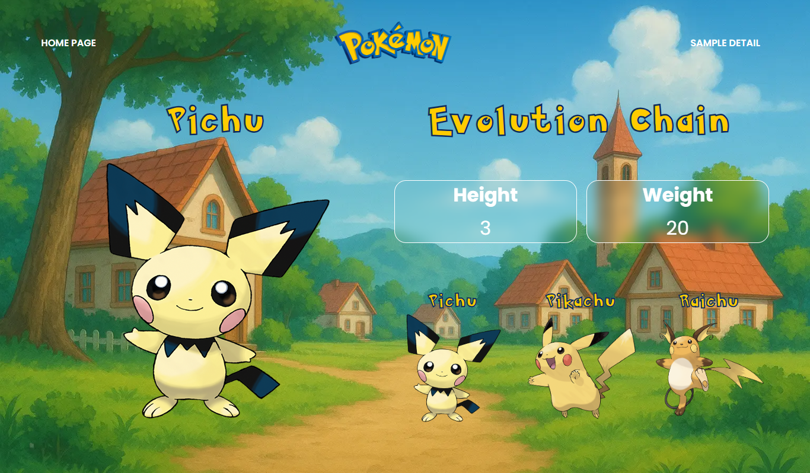

# Pokémon Evolution Viewer

A simple 2-page Nuxt 3 web app that displays base-evolution Pokémon from the [PokeAPI](https://pokeapi.co/).
You can browse through the Pokémon list, search by name, and view detailed information about each Pokémon’s evolution chain.

---

## Features

* Built with **Nuxt 3 (Composition API + TypeScript)**
* Uses **PokeAPI** for real-time Pokémon data
* **2 Pages**:

  * **Home:** List of Pokémon (with search & pagination)
  * **About:** Pokémon details + evolution chain
* **Smooth page transitions** between routes
* **Responsive design** for mobile and desktop
* **LocalStorage caching** to reduce API requests

---

## Tech Stack

* **Nuxt 3**
* **TypeScript**
* **PokeAPI**
* **CSS (custom responsive design)**
* **Google Fonts + Custom Pokémon Font**

---

## API Used

**PokeAPI**
Base URL: `https://pokeapi.co/api/v2/`

Used endpoints:

* `pokemon-species` → for base Pokémon list
* `pokemon/{name}` → for Pokémon detail data
* `evolution-chain` → for evolution data

---

## Setup Instructions

1. **Clone repository**

   ```bash
   git clone https://github.com/Rizkydba/pokemon-nuxt-test.git
   cd pokemon-nuxt-test
   ```

2. **Install dependencies**

   ```bash
   npm install
   ```

3. **Run development server**

   ```bash
   npm run dev
   ```

4. **Open in browser**

   ```
   http://localhost:3000
   ```

---

## Preview

| Home Page                                            | Detail Page                                              |
| ---------------------------------------------------- | -------------------------------------------------------- |
|  |  |

---

## License

RDBA © 2025 — Created for Frontend Test
